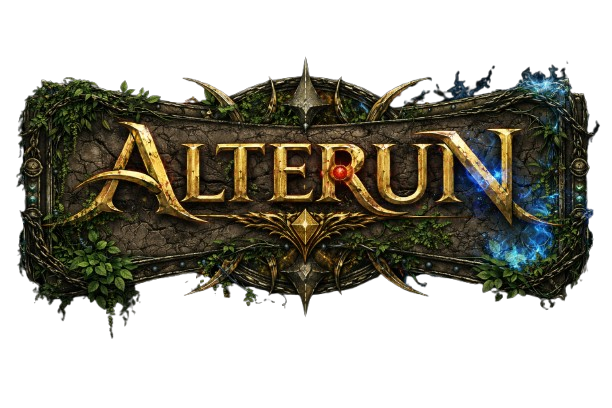

<p align="center">
  
</p>

# Alterun

The world of Alterun — a Next.js site with a blog (Martin/Sanderson style) and a **Codex** (wiki-style lore) with a dark fantasy theme. Admin dashboard with Supabase email auth.

## Stack

- **Next.js 14** (App Router), TypeScript, Tailwind CSS
- **Supabase** — Auth (email/password), Database, Storage (for images)
- Dark fantasy theme (gold/charcoal, ornate borders)

## Setup

1. **Install dependencies**
   ```bash
   pnpm install
   ```

2. **Supabase**
   - Create a project at [supabase.com](https://supabase.com).
   - In **Authentication > Providers**, enable **Email** (and optionally "Confirm email" off for local dev).
   - Create a user (Authentication > Users > Add user) or sign up via your app.
   - In **Project Settings > API**, copy the project URL and anon key.
   - Copy `.env.example` to `.env.local` and set:
     - `NEXT_PUBLIC_SUPABASE_URL`
     - `NEXT_PUBLIC_SUPABASE_ANON_KEY`
   - In the **SQL Editor**, run the contents of `supabase/schema.sql` to create tables and RLS.
   - To add featured image caption and position for codex entries, run `supabase/featured_image_caption_and_position.sql`.
   - To add pin-to-top for codex entries, run `supabase/pinned_codex_entries.sql`.

3. **Storage (for blog & codex images)**
   - In Supabase **Storage**, create a bucket named `images` and set it to **Public** if you want public image URLs.
   - Add policies so authenticated users can upload and the public can read (or follow Supabase storage docs).

4. **Run the app**
   ```bash
   pnpm dev
   ```
   Open [http://localhost:3000](http://localhost:3000). Go to **Admin** → **Login** to sign in.

5. **On commit** — [lint-staged](https://github.com/okonet/lint-staged) runs `eslint --fix` on staged `.js/.jsx/.ts/.tsx` files, then `pnpm run build` must pass (`.husky/pre-commit`). **Before pushing** — `pnpm run check` (lint + build) runs via `.husky/pre-push`. After `pnpm install`, run `pnpm exec husky init` once to enable hooks.

6. **Storybook** — Component library and button variations (including image-backed buttons).
   ```bash
   pnpm run storybook
   ```
   Open [http://localhost:6006](http://localhost:6006). Use the **Themes** toolbar addon to switch between Dark and Light.

## Routes

- `/` — Home
- `/blog` — Blog index (posts coming from Supabase)
- `/codex` — Codex index (entries by category, search)
- `/codex/[slug]` — Codex entry (body, images, related entries)
- `/admin` — Dashboard (requires login)
- `/admin/login` — Email login
- `/admin/blog` — Blog admin (create/edit posts)
- `/admin/codex` — Codex admin: list entries/categories, new entry, **Download database** (JSON export)
- `/admin/codex/entries/new` — New codex entry
- `/admin/codex/entries/[id]` — Edit entry (body, featured image, linked entries, extra images)
- `/admin/codex/categories` — List and add categories
- `/admin/codex/categories/[id]` — Edit category

## Codex

- **Entries**: title, slug, excerpt, body, category, featured image, linked entries, extra images.
- **Categories**: name, slug, description, sort order.
- **Images**: upload to Supabase Storage bucket `images` (path prefix `codex/`). Create the bucket and allow authenticated upload + public read.
- **Export**: “Download database” on Codex Admin downloads a JSON file of all categories, entries, links, and entry images.

## Next steps

- Wire blog list and post pages to `blog_posts` and add admin forms.
- Add search (Supabase full-text or external) for blog and codex.
- Add more ornate styling and embellishments to match the fantasy theme.
